# StormPlane
**《沙漠风暴》是一款类似于雷电的纵版射击游戏，以微信打飞机作为原型，通过自定义的SurfaceView来实现游戏。由于微信打飞机的游戏是黑白画风，游戏模式又太单一，感觉太无趣了，加上自己一直想设计一款像雷电那样的战机游戏，所以便动手写了这个Android小游戏。这款游戏以沙漠主题为背景，以要塞突击的模式进行游戏，所以取名为《沙漠风暴》**

##
**游戏已经在华为、小米等手机上测试通过，同时也支持各种机型，欢迎下载：[点击下载](https://fir.im/an5s)**

若以上链接失效，请戳这里：[apk下载](https://github.com/HurTeng/StormPlane/raw/master/app/app-release.apk)


# 游戏说明

 - 战机会自动发射子弹，玩家只需用手指控制战机，改变战机方向即可
 - 我方战机共有三种形态，各种战机的攻击方式跟子弹威力均不相同
 - 敌机也分为好几种，每种敌机血量、移动方式、攻击模式也不同
 - 敌机在血量降低到一定阈值时，将会进入狂暴模式，战力大幅提升
 - BOSS有多种状态模式，移动方式跟子弹类型会随着相应的状态而改变
 - 游戏中会出现各种辅助道具，比如导弹，子弹等，玩家可以通过道具增强战力
 - 游戏中有各种游戏特效，比如战机爆炸，导弹引爆，无敌光辉等，画面华丽
 - 游戏分六个等级，等级随着分数的增加而提升，同时敌军也会越来越强力
 - 游戏会记录分数，击落不同的敌机能获取到相应的分数，分数代表着战绩

 # 我方战机
 
 1.蓝色战机『 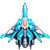』：初始时默认的战机，子弹类型为蓝色激光粒子弹，威力小，直线射击

2.紫色战机『 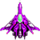』：子弹类型为紫色双螺旋粒子炮，威力中等，但可以同时发射出两发子弹，伤害值也是很可观

3.红色战机『 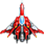』：子弹类型为红色追踪战斧冲击波，威力是三者中最大的，能够进行全屏追击射击，输出狂暴


 # 敌方战机
 1. 敌方小型机：战力最弱，以飘动方式移动，初期不具备威胁性。后期移动速度提升后，要小心防范，以免被撞机

  	

 2. 敌方中型机：实力一般，直线移动，血量比小型机多，靠后推力移动。初期不具备太大威胁，后期速度大幅提升后，将会以导弹的方式，进行垂直冲撞攻击，由于血量稍多，如果不能在俯冲时将其击毁，就通过移动的方式躲开其攻击
 
 	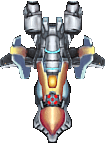

 3. 敌方大型机：实力仅次于BOSS，皮粗血厚，同时还能发射子弹，移动力稍差。大型机虽然移动缓慢，但一般是成群出现，联合形成一道肉墙，阻断路线的同时，发射出烈焰飘雪弹，初期便具有强大杀伤力，后期更是具备了变身能力，血量提升的同时，发射子弹的速度也更快，不容易对付

 	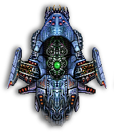

 4. 敌方BOSS机：游戏中实力最强的存在，拥有各种移动方式以及攻击模式，子弹杀伤力也很恐怖。BOSS共有四种状态：普通状态，愤怒状态， 疯狂状态，极限状态，状态随着血量值而改变：初始为普通状态（蓝色机体），移动方式为左右移动，子弹输出较为平缓，相对容易对付；进入愤怒状态时（棕色机体），BOSS将挪到最底下（射击盲区），由下往上发射子弹，这个状态最难缠，BOSS占据了我方机体的下方位置，跟前方的敌机形成前后夹击，而且我方机体的活动空间大大减小，同时由于子弹受限，无法攻击到最底下的BOSS机，只能用导弹去轰炸BOSS，建议多留点导弹备用；愤怒状态不会持续很久，很快BOSS将进入疯狂状态（红色机体），这个状态下，BOSS会上下左右全屏移动，同时进行全方位扫射，要注意躲开BOSS的攻击；极限状态跟疯狂状态相似（红色机体），但移动速度更快，冲撞更猛烈，输出更疯狂，这个时候BOSS血量已经接近极限，机体也在不断闪烁，此时只需持续攻击，就能击沉BOSS机体

 	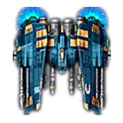

# 道具清单
 1. 紫色弹夹『』：获得后会我方机体会变成紫色战机，子弹自动切换成紫色的螺旋粒子炮，两边同时发射子弹
 

 2. 红色弹夹『』：获得后会我方机体会变成红色战机，子弹自动切换成红色的战斧冲击波，带全屏追击扫射功能

 3. 导弹物品『』：获得后会存放到导弹仓库中（上限为:X9），可以在游戏中进行使用，能对全屏敌机造成大量伤害

 4. 生命物品『』：获得后我方生命+1（上限为:X9），生命值为0时，游戏结束


# 子弹类型
1. 我方机体的蓝色激光粒子弹『
 』：我方战机的默认子弹，威力小，直线射击，特殊子弹的弹夹不足时，会自动恢复成该子弹

	效果图预览

	 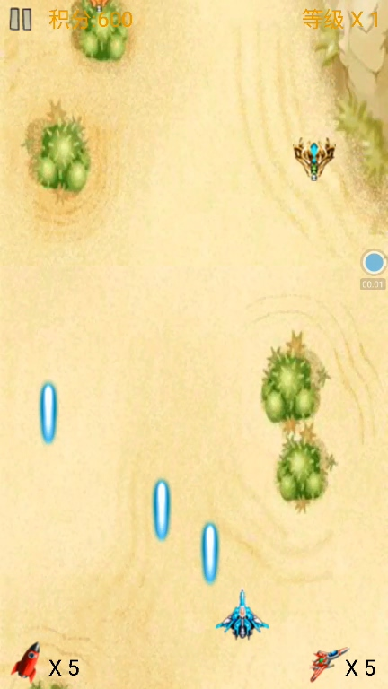

2. 我方机体的紫色双螺旋粒子炮『 』：双发齐射，威力中等，弹道为螺旋形，需要通过获得特殊弹夹来获取，持续时间为15s

	效果图预览
	
	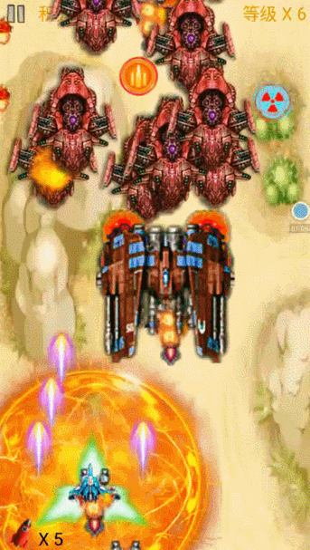


3. 我方机体的红色追踪战斧冲击波『 』：单发速射，威力最强，弹道不固定，能够进行全屏追击射击，需要通过获得特殊弹夹来获取，持续时间为15s

	效果图预览

	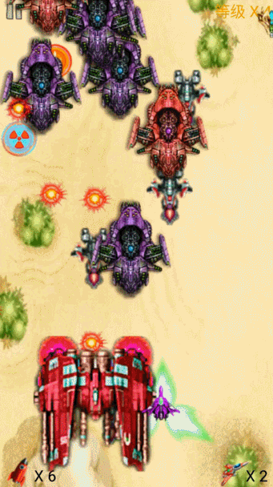
	

4. 敌方大型机的烈焰飘雪弹『』：红色颗粒子弹，伤害一般，发射后会像雪花般左右飘落下来，配合大型机群的联动输出，威力十足

	效果图预览

	

5. BOSS机的火焰弹『』：BOSS的默认子弹，初期为普通的单发直线射击，威力一般，后期加强后会变成连续喷射的火焰阵，威力大幅提升

	初期火焰弹效果图预览

	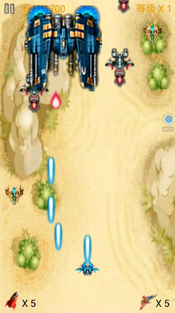

	后期火焰阵效果图预览

	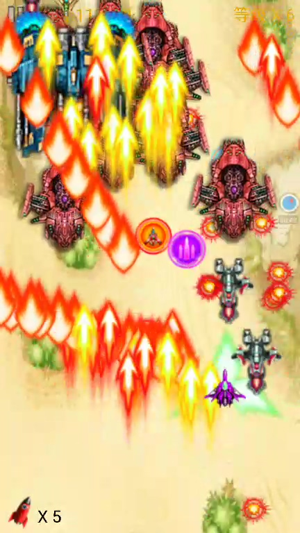

6. BOSS机的闪光粒子球『』：金黄色颗粒状的子弹，伤害一般，弹道为横向飘动，移动速度极快，宛如幽灵一般

	效果图预览

	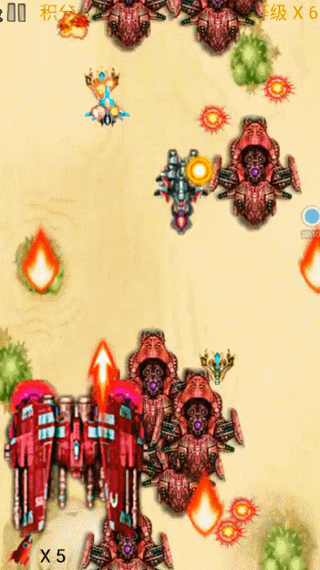

7. BOSS的悬浮三角颗粒『』:三角状的漂浮物，威力一般，向上漂浮挪动，移动速度缓慢，像个漂浮炸弹一样占据着空间，具备战略意义

	效果图预览

	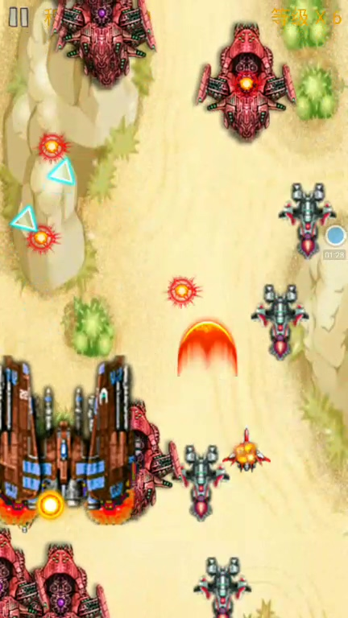

8. BOSS的双生闪电球『 ，』：红绿色的闪电球状物，威力中等，以'S'型螺旋上升移动，速度中等，是BOSS在屏幕下方时的主要攻击方式

	效果图预览

	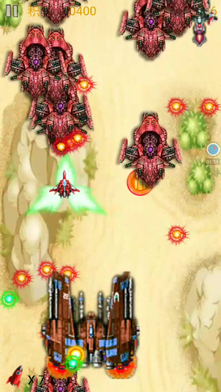

9. BOSS的恶魔地狱火『 ， 』：BOSS的终极武器，威力强大，黄色火焰移动平稳，红色火焰移动飘忽，地狱火由沙漠中冒出，不断向上蔓延，可以进行全屏无缝攻击，配合BOOS的火焰阵，威力巨大

	效果图预览

	


# License
```
Copyright 2016 HurTeng

Licensed under the Apache License, Version 2.0 (the "License");
you may not use this file except in compliance with the License.
You may obtain a copy of the License at

   http://www.apache.org/licenses/LICENSE-2.0

Unless required by applicable law or agreed to in writing, software
distributed under the License is distributed on an "AS IS" BASIS,
WITHOUT WARRANTIES OR CONDITIONS OF ANY KIND, either express or implied.
See the License for the specific language governing permissions and
limitations under the License.
```
